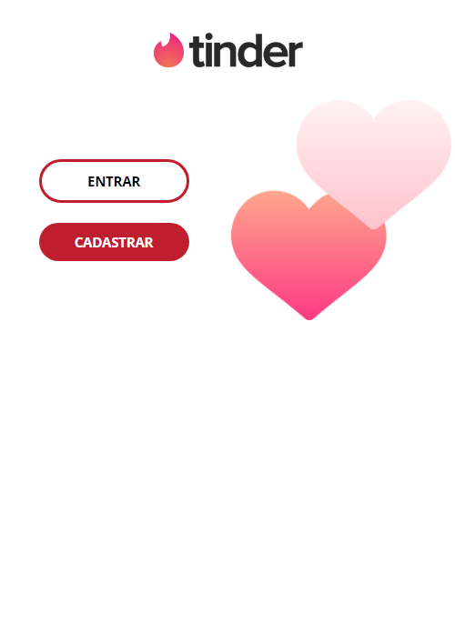
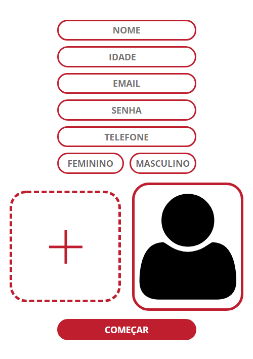
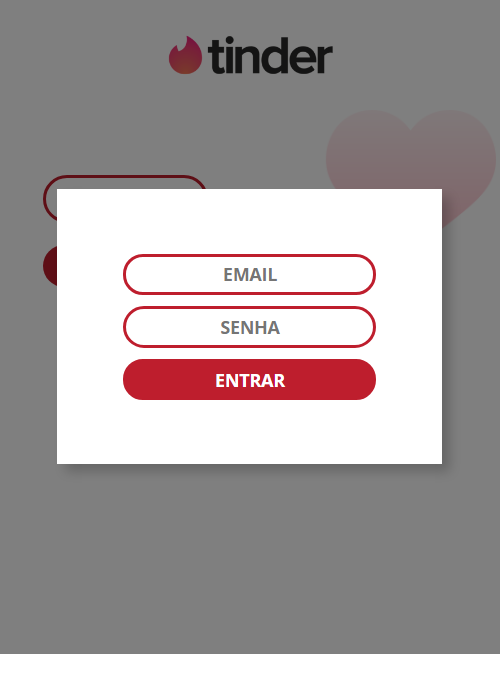
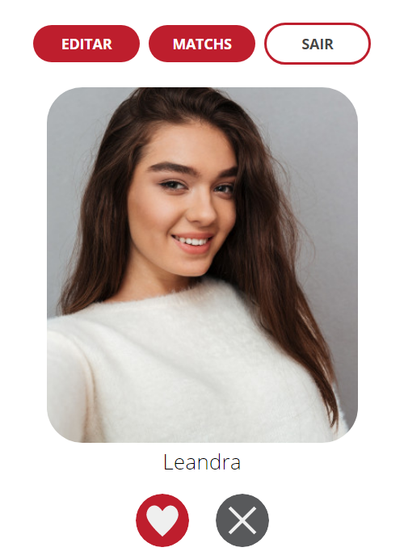
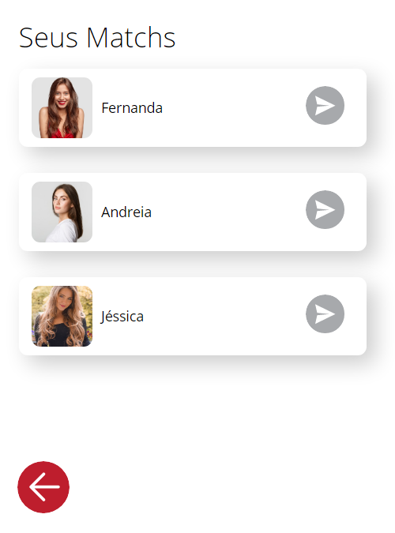
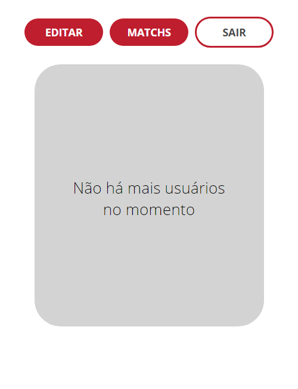

# Mini Tinder
Projeto clone Tinder em uma versão simplificada

A ideia do projeto foi resumir alguns dos principais conceitos que aprendi no curso de Fullstack Developer com JavaScript.

<u>Tenologias Backend:</u> *Node JS com Express JS, Express Session, Formidable.*

<u>Tecnologias Frontend:</u> *EJS, HTML, CSS e JavaScript.*

**Express Session** foi usado para criar a persistência de dados com login. 

**Formidable** foi usado para pegar imagens do formulário e enviar para servidor.

**EJS** foi escolhido como template engine porque através do express foi possível enviar mensagens de erro de login e a validação de cadastro sem a necessidade de mensagens flash. 

Além de evitar requisições via Fetch para buscar dados no servidor. 

## Maior desafio
A parte mais complicada aconteceu no meio do projeto. 

Antes a parte do Game estava estrutura para que ao curtir ou descurtir um usuário imediatamente fosse enviado o ID do usuário para o banco de dados.

Após alguns testes descobri que o Google Chorme só aceita 7 requisições get ou post por usuário.

Para superar esse desafio criei um array com os dados de todos os usuários curtidos e sempre que o Game termina todos os IDs de usuários curtidos ou descurtidos são enviados juntos. 

## Telas do App

## Outras observações
- IDs de cada usuário são gerados usando o construtor de data.
- O ID do usuário é o mesmo nome da imagem. Por conta da extensão, cada imagem é referenciada no banco de dados com o usuário.